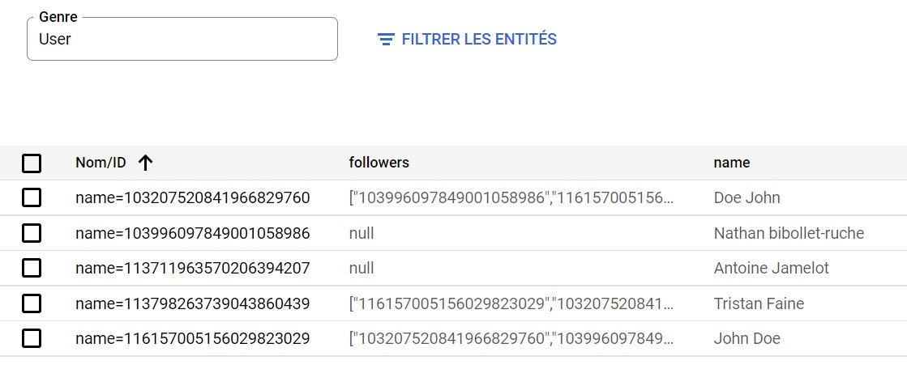
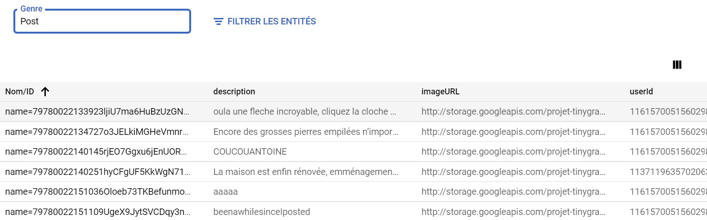
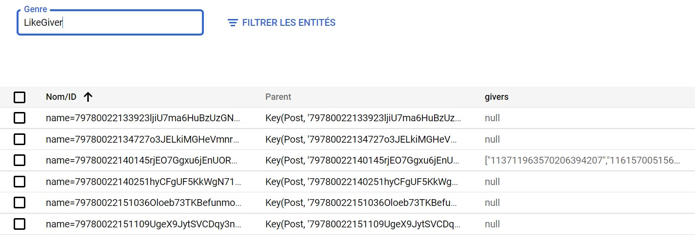

# TinyGramM1

## Initialisation/build

```
 git clone https://github.com/TristanFaine/TinyGramM1.git
 cd TinyGramM1
 mvn clean install
 mvn package
```

### Veuillez penser à modifier les paramètres suivants :

- "projet-tinygram-tf" avec votre ID projet google dans pom.xml
- "projet-tinygram-tf" avec votre ID projet google dans src/main/webapp/WEB-INF/appengine-web.xml
- Les \<env-variables\> dans src\main\webapp\WEB-INF\appengine-web.xml

Notre application utilise Cloud Storage pour stocker des données d'images, vous devez donc configurer un projet app engine à l'avance
### Commandes gcloud pour créer un projet (SDK gcloud : https://cloud.google.com/sdk/install)

```
gcloud init (une seule fois pour configurer l'installation locale du SDK)
gcloud projects create
gcloud app create
gcloud config set project my-project-id
```

- Application en local

```
mvn package
mvn appengine:run
```

- Déploiement Google
  )

```
mvn appengine:deploy
gcloud app browse
```

## Accès API REST

```
https://endpointsportal.projet-tinygram-tf.cloud.goog/
```

## Aperçu des `Kind`






Voir aussi le fichier [`index.yaml`](src/main/webapp/WEB-INF/index.yaml)
