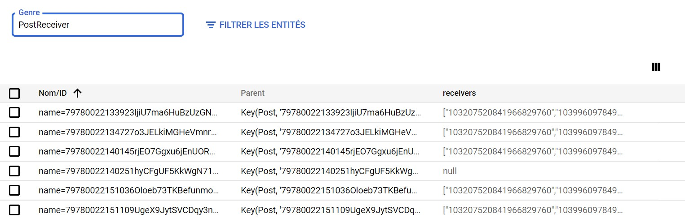

# TinyGramM1

## Initialisation/build

```
 git clone hhttps://github.com/TristanFaine/TinyGramM1.git
 cd TinyGramM1
 mvn install
```

### Veuillez penser à modifier les paramètres suivants :

- "projet-tinygram-tf" avec votre ID projet google dans pom.xml
- "projet-tinygram-tf" avec votre ID projet google dans src/main/webapp/WEB-INF/appengine-web.xml
- Les <env-variables> dans src\main\webapp\WEB-INF\appengine-web.xml

## Commandes gcloud (penser à d'abord installer le SDK gcloud : https://cloud.google.com/sdk/install)

```
gcloud init (une seule fois pour configurer l'installation locale du SDK)
gcloud app create
```

- Avant execution

```
mvn clean install
```

- Application en local

```
mvn package
mvn appengine:run
```

- Déploiement Google
  )

```
mvn appengine:deploy
gcloud app browse
```

## Accès API REST

- New version of endpoints (see https://cloud.google.com/endpoints/docs/frameworks/java/adding-api-management?hl=fr):

```
mvn clean package
mvn endpoints-framework:openApiDocs
gcloud endpoints services deploy target/openapi-docs/openapi.json
mvn appengine:deploy
```

## Aperçu des `Kind`





Voir aussi le fichier [`index.yaml`](src/main/webapp/WEB-INF/index.yaml)